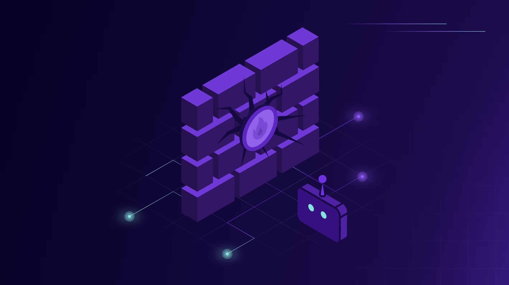

# Agent Control Standard

**Making AI agents trustworthy by standardizing observability and control.**

## Rationale

Agents must become trustworthy to enable wide-scale adoption.

Transparency is the foundation of trust. Whether agents are built in-house or adopted as part of a service, consumed in the cloud, as SaaS, on-prem or on endpoints, they must be observable by the enterprise that welcomes them in. We cannot trust a magic black box.

For agents to become trustworthy, they must be **inspectable, traceable and instrumentable**.

- **Inspectable:** We do not have to guess what is inside. We can see which tools, models and capabilities are being used, what software version is running, who built it, which services sit behind it, and which data it can access. This must dynamically adapt to rapid changes in agent components.
- **Traceable:** We know what the agent did and why. We can trace any action back to the reasoning behind it and the originating task, even if the thread goes through multiple agents and software systems. In case of compromise, we can identify and remediate the root cause.
- **Instrumentable:** We can hook into agent execution and steer it in the right direction. We can put hard controls around agents, define their scope of action, apply centralized enterprise logic across agent platforms, and prevent or modify behavior when required.

## Key Components

The standard covers:

1. ACS definitions for the interaction between the observed agent and the guardian agent.
2. Observability requirements and implementations for tracing ACS events using OpenTelemetry and OCSF.
3. Agent BOM, or AgBOM, requirements and implementations for exposing a dynamic agent bill of materials through CycloneDX, SWID and SPDX.

## Getting Started

- **Explore the Documentation:** Visit the [Documentation Site](https://agentcontrolstandard.org) for the complete overview, specification, tutorials and guides.
- **View the Specification:** [Specification](https://github.com/Agent-Control-Standard/ACS/tree/main/specification)

## Contributing

We welcome community contributions to enhance and evolve ACS.

- **Questions & Discussions:** Join our [GitHub Discussions](https://github.com/Agent-Control-Standard/ACS/discussions).
- **Issues & Feedback:** Report issues or suggest improvements via [GitHub Issues](https://github.com/Agent-Control-Standard/ACS/issues).
- **Contribution Guide:** See [CONTRIBUTING.md](CONTRIBUTING.md) for details.

## What's next

### v0.1 Public Preview

- Overall documentation and requirements.
- ACS definitions and schema.
- Observability definitions for OpenTelemetry and OCSF.
- AgBOM requirements.

### v1

- Implementation of agent instrumentation.
- Implementation of a guardian agent sample app with:
  - ACS support.
  - ACS to OpenTelemetry mapper.
  - ACS to OCSF mapper.
- FastMCP client instrumentation for ACS.
- A2A client instrumentation for ACS.

### v2

- Requirements for CycloneDX, SPDX and SWID.
- Implementation of ACS to AgBOM mappers for CycloneDX, SPDX and SWID.

### v3

- Extending A2A and MCP to support deny and modify operations.
- Implementation of an agent with deny and modify support.

## About

ACS is an open-source project under the [MIT License](LICENSE.txt), and is open to community contributions.
